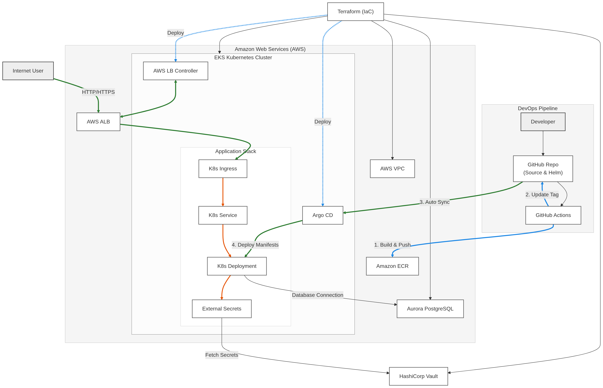

# GitOps-Based Kubernetes Deployment Platform

[](https://www.terraform.io/)
[](https://kubernetes.io/)
[](https://aws.amazon.com/)
[](https://argoproj.github.io/cd/)
[](https://www.vaultproject.io/)

A production-grade, GitOps-driven container deployment platform built on **Amazon EKS (Elastic Kubernetes Service)**. This project demonstrates automated multi-arch **CI/CD via GitHub Actions**, declarative configuration synchronization with **ArgoCD**, secure secrets management using **HashiCorp Vault** & **External Secrets Operator (ESO)**, and a managed high-availability **Amazon Aurora PostgreSQL** database.

---

## 🏗️ System Architecture & GitOps Workflow

Below is the conceptual architecture and workflow diagram for the deployment pipeline:



### Workflow Lifecycle:
1. **Infrastructure Provisioning**: Terraform deploys the core AWS infrastructure (VPC, IAM, EKS Cluster, Managed Node Groups, AWS ALB Controller, Aurora PostgreSQL) and installs HashiCorp Vault. The random, secure database credentials generated by Terraform are automatically pushed and stored in Vault's Key-Value (KV) Secrets Engine.
2. **CI Pipeline (GitHub Actions)**: On publishing a GitHub release, a runner compiles and builds multi-arch (`amd64` and `arm64`) Docker images for the Node.js application, pushes them to Amazon ECR, updates the image repository and tag in `helm/my-app/values.yaml`, and pushes the updated chart back to the Git repository.
3. **GitOps CD (ArgoCD)**: ArgoCD monitors the Git repository. Upon detecting a change in the Helm chart values, it automatically reconciles and syncs the state to the EKS cluster.
4. **Secrets Syncing (External Secrets Operator)**: An `ExternalSecret` resource in EKS communicates with the `ClusterSecretStore` connected to HashiCorp Vault. It securely retrieves the database credentials and populates a native Kubernetes Secret (`my-app-secret`) to be injected into the application pods as environment variables.
5. **Traffic Routing**: The AWS Load Balancer Controller provisions an Application Load Balancer (ALB) dynamically to route external traffic via Ingress to the application pods.

---

## 📂 Repository Structure

```text
├── .github/workflows/      # GitHub Actions Workflows
│   └── release-ci.yaml     # CI pipeline for building images and updating Helm tags
├── app/                    # Node.js Demo Application
│   ├── src/                # Express server and database connection pool
│   ├── Dockerfile          # Multi-arch Docker configuration
│   └── package.json        # Dependencies (Express, pg)
├── argocd/                 # ArgoCD Application Manifests
│   └── my-app.yaml         # ArgoCD App definition syncing helm/my-app
├── aws/                    # AWS & Kubernetes helper manifests
│   ├── external-secrets/   # ClusterSecretStore mapping Vault backend
│   └── ingressclass.yaml   # ALB Ingress Class manifest
├── helm/my-app/            # Application Helm Chart
│   ├── templates/          # Deployment, HPA, Ingress, Secret, Service templates
│   └── values.yaml         # Configurable Helm values (image, replicas, resources)
└── terraform/              # Infrastructure as Code (IaC)
    ├── environments/dev/   # Environment specific configs (VPC, EKS, RDS)
    └── modules/            # Reusable modules (VPC, IAM, EKS, ALB-controller, Vault, RDS)
```

---

## 🚀 Step-by-Step Setup Guide

### Prerequisites
Before you start, make sure you have installed:
- [AWS CLI](https://aws.amazon.com/cli/) (configured with appropriate credentials)
- [Terraform](https://www.terraform.io/)
- [kubectl](https://kubernetes.io/docs/tasks/tools/)
- [Helm](https://helm.sh/)

---

### Step 1: Provision Infrastructure with Terraform
Navigate to the Terraform dev environment directory to initialize and provision all resources:
```bash
cd terraform/environments/dev

terraform init
terraform fmt
terraform validate
terraform plan
terraform apply --auto-approve
```
> [!NOTE]
> Terraform will provision the network, EKS Cluster, and an Aurora PostgreSQL database. Additionally, it installs Vault via Helm and registers the generated database credentials directly into Vault's KV Engine.

---

### Step 2: Connect to EKS Cluster
Update your local kubeconfig to connect to the newly created EKS cluster:
```bash
aws eks update-kubeconfig --region ap-southeast-1 --name eks-lab

# Verify nodes are active
kubectl get nodes
```

---

### Step 3: Deploy Metrics Server
Deploy the Kubernetes Metrics Server required for scaling with the Horizontal Pod Autoscaler (HPA):
```bash
kubectl apply -f https://github.com/kubernetes-sigs/metrics-server/releases/latest/download/components.yaml

# Patch Metrics Server to ignore insecure TLS certificates (for development)
kubectl patch deployment metrics-server -n kube-system --type='json' \
  -p '[{"op": "add", "path": "/spec/template/spec/containers/0/args/-", "value": "--kubelet-insecure-tls"}]'

# Verify Metrics Server is running
kubectl get deployment -n kube-system | grep metrics-server
kubectl top node
```

---

### Step 4: Install and Expose ArgoCD
Deploy ArgoCD to manage deployments via GitOps:
```bash
kubectl create namespace argocd
kubectl apply -n argocd --server-side --force-conflicts -f https://raw.githubusercontent.com/argoproj/argo-cd/stable/manifests/install.yaml

# Expose ArgoCD server using an AWS LoadBalancer
kubectl patch svc -n argocd argocd-server -p '{"spec": {"type": "LoadBalancer"}}'

# Get LoadBalancer URL
kubectl -n argocd get svc argocd-server

# Retrieve initial ArgoCD admin password
kubectl -n argocd get secret argocd-initial-admin-secret -o jsonpath="{.data.password}" | base64 -d
```

---

### Step 5: Install & Configure External Secrets Operator (ESO)
Deploy the External Secrets Operator and configure connection to HashiCorp Vault:
```bash
# Add ESO Helm Repository
helm repo add external-secrets https://charts.external-secrets.io
helm repo update

# Install External Secrets Operator
helm install external-secrets external-secrets/external-secrets \
  -n external-secrets \
  --create-namespace

# Create a Kubernetes Secret storing the Vault Token
kubectl create secret generic vault-token \
  -n external-secrets \
  --from-literal=token="<YOUR_VAULT_TOKEN>"

# Configure the ClusterSecretStore to connect EKS to the Vault backend
kubectl apply -f aws/external-secrets/vault-backend.yaml
```

---

### Step 6: Deploy the Application using ArgoCD
Apply the ArgoCD application manifest to trigger the GitOps sync:
```bash
kubectl create namespace my-app
kubectl apply -f argocd/my-app.yaml
```
ArgoCD will automatically pull the Helm chart from the Git repository, leverage ESO to sync credentials from Vault, deploy application pods, and hook them up to the AWS Application Load Balancer.

---

## ⚡ Demo Application Endpoints

Once deployed, the Node.js application exposes the following REST APIs:

| Endpoint | Method | Description |
|---|---|---|
| `/` | `GET` | Returns API deployment info & running status |
| `/health` | `GET` | Simple health check endpoint |
| `/db-check` | `GET` | Connects to Aurora PostgreSQL and returns database system time |
| `/users` | `GET` | Retrieves all users list from the database |
| `/users` | `POST` | Inserts a new user record. Requires JSON payload: `{"name": "...", "email": "..."}` |

